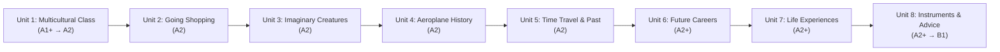

# Total Pedagogical Review: Units 1 to 8
## English 6th Grade — Digital Coursebook Companion (ΣΤ΄ Δημοτικού)

---

### Executive Summary

This pedagogical review evaluates the educational architecture, curricular alignment, psycholinguistic design, and multimodal scaffolding implemented across **Units 1 through 8** of the English 6th Grade Digital Coursebook Companion (*ΣΤ΄ Δημοτικού*). 

The platform serves as an open-source, offline-first digital learning companion designed for 11–12 year-old primary school learners in Greek public schools. It aligns directly with the official curriculum prescribed by the **Greek Ministry of Education (DEPPS-APS / ITYE Diophantus)** and the **Common European Framework of Reference for Languages (CEFR)**, facilitating a measured, scaffolded progression from **CEFR A1+ / A2 consolidation** through to the **CEFR A2+ / B1 threshold**.

---

### 1. Curricular & Pedagogical Framework

#### 1.1 Curricular Grounding
The companion adheres to the principles of the **DEPPS-APS** (Cross-Thematic Curriculum Framework for Foreign Languages in Greece):
- **Communicative Language Teaching (CLT)**: Language is presented and practiced in meaningful, socially relevant communicative contexts rather than isolated grammatical drills.
- **Task-Based Learning (TBLT)**: Each unit culminates in real-world communicative output, including guided writing workshops, poster projects, problem-solving advice columns, and cross-cultural comparisons.
- **Cross-Curricular Integration (CLIL Elements)**: The syllabus integrates English with History, Geography, Music, Environmental Studies, Physical Education, Civics, and Financial Literacy.

#### 1.2 CEFR Developmental Trajectory (Units 1–8)

- **Units 1–3 (A1+ to A2 Consolidation)**: Focused on concrete immediate reality—classroom identity, shopping transactions, physical descriptions, and comparative forms.
- **Units 4–5 (A2 Historical Narrative & Time Contrasts)**: Expands temporal horizons into aviation history, local heritage, and contrast between past habits (*used to*) and present realities.
- **Units 6–8 (A2+ to B1 Bridge)**: Moves into abstract, speculative, experiential, and interpersonal communicative functions—career aspirations, lifelong achievements (Present Perfect Simple/Continuous), modal obligation/advice (*must*, *should*, *ought to*), and socio-emotional perspective-taking.

---

### 2. Core Instructional Architecture (The 7-Pillar V2 Experience)

Every unit in the companion implements a consistent, research-backed instructional sequence:

1. **Hero & Schema Activation**:
   - Clear thematic banner, subtitle, and CEFR level badge.
   - Activates prior knowledge and establishes communicative purpose before lexical immersion.

2. **Interactive Illustrated Narratives (4 Stories per Unit)**:
   - Culturally diverse and localized narratives featuring young relatable protagonists across Greece, Europe, and the world.
   - **100% Lexical Ownership**: Every single unit vocabulary item mapped to a story is integrated verbatim into its narrative text. No orphaned vocabulary items; no artificial vocabulary dumps.
   - **Clickable Landmark Pills**: Learners interact with cultural, technical, and contextual landmarks that directly highlight and link to official vocabulary entries.

3. **Inductive Grammar Lab**:
   - Replaces traditional deductive "rule-first" lecturing with an inductive discovery approach.
   - Learners encounter target grammatical structures in authentic contexts, identify patterns through guided observation, discover signal words, test their understanding through targeted practice items with pedagogical explanations, and listen to authentic multi-turn spoken dialogues.

4. **Collocations & Word Families**:
   - Emphasizes lexical chunking over isolated word lists, developing natural fluency and idiomatic competence.
   - Provides Greek translational equivalents (*meaning_gr*) for cognitive cross-linguistic mediation, bridging the L1 conceptual base to L2 idiomatic expression.

5. **Definition Challenge**:
   - Interactive formative retrieval practice.
   - Multiple-choice questions requiring learners to match definitions and clues to target vocabulary, reinforcing semantic memory and reading comprehension.

6. **Guided Writing Workshop**:
   - Follows genre-based writing pedagogy:
     1. Authentic model text.
     2. Scaffolding steps (brainstorming, organization, grammar reminders).
     3. Self-assessment checklist promoting self-monitoring and editing skills.

7. **Can-Do Self-Assessment**:
   - Directly derived from CEFR illustrative descriptor scales.
   - Promotes metacognitive awareness and autonomous learning by allowing pupils to self-evaluate their communicative competence across listening, reading, speaking, and writing.

---

### 3. Unit-by-Unit Pedagogical Analysis

#### Unit 1: Our Multicultural Class
- **Curricular Focus**: Cultural diversity, personal introductions, daily habits vs. ongoing activities.
- **Grammar Focus**: Present Simple (routines, habits, frequency adverbs) vs. Present Continuous (actions happening now).
- **Pedagogical Strengths**: Establishes an inclusive, welcoming classroom environment; validates diverse linguistic and cultural backgrounds; introduces the interactive companion methodology.

#### Unit 2: Going Shopping
- **Curricular Focus**: Consumer education, food markets, supermarket navigation, healthy eating habits.
- **Grammar Focus**: Countable vs. Uncountable nouns; quantifiers (*much/many*, *some/any*, *a few/a little*); verbs of the senses (*taste, smell, look*).
- **Pedagogical Strengths**: High pragmatic utility in everyday situations; concrete realia and visual grocery representations reduce affective filter for anxious learners.

#### Unit 3: Imaginary Creatures
- **Curricular Focus**: Literature, mythology, Shakespeare's *A Midsummer Night's Dream*, describing appearance and character traits.
- **Grammar Focus**: Comparative and Superlative adjectives; opposites with negative prefixes (*un-*, *im-*, *dis-*).
- **Pedagogical Strengths**: Stimulates creative imagination and narrative appreciation; bridges classic English literature with ancient Greek mythology (centaurs, minotaurs) for meaningful cross-cultural resonance.

#### Unit 4: The History of the Aeroplane
- **Curricular Focus**: Aviation history, inventors, forces of flight, Daedalus & Icarus, the Wright Brothers.
- **Grammar Focus**: Past Simple vs. Past Continuous (interrupted actions with *when* / *while*); sequential time linkers.
- **Pedagogical Strengths**: Rich cross-curricular STEM/History connection; develops chronological narrative skills and past-tense aspectual awareness.

#### Unit 5: Travelling Through Time
- **Curricular Focus**: Local history, Victorian transport, changes in technology and daily life, asking for and giving directions.
- **Grammar Focus**: *Used to* + infinitive (past habits and states no longer true); directional prepositions and imperative routing.
- **Pedagogical Strengths**: Explores local urban evolution; incorporates analytical educational engagement with cultural history (including Beatles' "Yesterday" past-state analysis under educational fair use); reinforces spatial orientation.

#### Unit 6: Me, Myself and My Future Job
- **Curricular Focus**: Career guidance, modern and emerging professions (jewellery designer, air traffic controller, home health nurse, ecologist/hairdresser), workplace traits.
- **Grammar Focus**: Modal verbs (*can, may, should*); Future intentions and predictions (*will* vs. *be going to*).
- **Pedagogical Strengths**: Fosters career exploration free from gender stereotypes; introduces environmental and community-focused jobs; analyzes future predictions through Doris Day's classic "Que Será, Será" within an educational framing.

#### Unit 7: Share Your Experiences
- **Curricular Focus**: World records, Olympic & Paralympic sports, swimming strokes, hot-air balloon flights, classical and modern theatre.
- **Grammar Focus**: Present Perfect Simple (life experiences with *ever/never*, completed results with *already/yet*) vs. Past Simple (definite finished past); Present Perfect Continuous (*have been -ing*) with *for* and *since*.
- **Pedagogical Strengths**: Celebrates resilience, diversity, and disability inclusion through the real-life accomplishments of Greek Paralympic swimming champion Konstantinos Fykas; clarifies the notorious English Present Perfect aspect through concrete experiential timelines.

#### Unit 8: Blow Your Own Trumpet
- **Curricular Focus**: Musical instruments (strings, brass, woodwind, percussion), rock band collaboration, pocket money budgeting and consumer research, fables and anti-bullying problem page advice.
- **Grammar Focus**: Modal verbs of ability (*can/could/be able to*), obligation (*must/have to*), lack of necessity (*don't have to*), prohibition (*mustn't*), and advice (*should/ought to/why don't you*).
- **Pedagogical Strengths**: Integrates financial literacy (smart saving jars, consumer rights); uses an innovative fairy tale adaptation (the "Big Bad Wolf" asking for advice to make friends and play trumpet) to teach empathy, active listening, conflict resolution, and sincere apology.

---

### 4. Psycholinguistic & Multimodal Scaffolding

#### 4.1 Strict CEFR Lexical Control
To maintain learner confidence and avoid cognitive overload:
- **Ceiling Rules**: All English definitions strictly capped at **< 18 words**.
- **Lexical Filter**: Audited via `check_definitions.py` against CEFR A1/A2 lemmas. Definitions use high-frequency, comprehensible vocabulary, avoiding circularity, meta-linguistic jargon, or target word leaks.
- **Full Story Ownership**: Across all units, 100% of assigned vocabulary IDs are naturally contextualized within the story narratives.

#### 4.2 Dual-Engine Audio & Phonological Loop Support
- **Google Standard TTS**: Provides crisp, neutral, phonemically transparent speech synthesis ideal for baseline phonetic identification.
- **Edge Neural TTS (`en-GB-SoniaNeural`)**: Provides natural British English intonation, authentic prosody, sentence stress, and conversational rhythm.
- **Queued Three-Part Playback Protocol**:
  $$\text{Word} \;\xrightarrow{\text{350ms pause}}\; \text{Definition} \;\xrightarrow{\text{350ms pause}}\; \text{Example Sentence}$$
  This 350ms cognitive pause gives the learner's working memory time to process phonological inputs before the semantic definition and contextual example sentence are presented.
- **Verbatim `.txt` Sidecars**: Every single audio clip is accompanied by an exact UTF-8 text transcript sidecar, supporting multimodal "read-along" audio-assisted reading for learners with dyslexia or auditory processing differences.

#### 4.3 High-Fidelity Vector Graphics (SVGs)
- All illustrations across Units 5–8 are bespoke, scalable SVG vector graphics designed without external dependencies.
- Vector rendering ensures crisp display across all student device screens (smartphones, school tablets, interactive whiteboards, desktop PCs) without pixelation or high bandwidth requirements.

---

### 5. Fair Use, Open Source & Legal Ethics

The companion is distributed under open educational principles (Creative Commons / Public Educational Derivative):
- **Fair Use Doctrine in Education**: References to culturally significant works—such as The Beatles' "Yesterday" (Unit 5), Doris Day's "Que Será, Será" (Unit 6), and ABBA's "Money, Money, Money" (Unit 8)—are conducted strictly for non-profit, educational language analysis (identifying grammatical structures, discussing lyrical themes, and analyzing song forms).
- **No Copyright Infringement**: No raw copyrighted commercial MP3 recordings or full verbatim lyrics are distributed or stored in the repository. Spoken instructional dialogues, student reflections, and original musical descriptions are utilized instead.
- **Zero-Tracking GDPR Compliance**: The entire companion operates 100% client-side. There are no tracking scripts, analytics cookies, remote fonts, or telemetry calls. The application can run entirely offline via local `file://` protocols, safeguarding pupil privacy.

---

### 6. Comprehensive Syllabus Matrix (Units 1–8)

| Unit | Title | CEFR Level | Core Grammar | Lexical Theme | Cross-Curricular |
| :---: | :--- | :---: | :--- | :--- | :--- |
| **1** | *Our Multicultural Class* | A1+ → A2 | Present Simple vs. Continuous, Frequency Adverbs | Diversity, Routines, Countries & Nationalities | Geography, History, Civics |
| **2** | *Going Shopping* | A2 | Countables/Uncountables, Quantifiers, Sense Verbs | Groceries, Supermarket, Menus, Quantities | Health Ed, Maths, Consumer Studies |
| **3** | *Imaginary Creatures* | A2 | Comparison of Adjectives & Adverbs, Opposites | Mythology, Fairy Tales, Shakespeare, Traits | Literature, Theatre, Art |
| **4** | *The History of the Aeroplane* | A2 | Past Simple vs. Past Continuous, Time Linkers | Aviation, Inventions, Flight Forces, Chronology | STEM, History, Technology |
| **5** | *Travelling Through Time* | A2 | *Used to* (Past Habits), Giving Directions | Transport, Local History, Directional Prepositions | Local History, Music, Road Safety |
| **6** | *Me, Myself and My Future Job* | A2+ | Modals (*can, may, should*), Future (*will* vs *going to*) | Professions, Workplaces, Traits, Safety | Career Guidance, Citizenship |
| **7** | *Share Your Experiences* | A2+ | Present Perfect Simple & Continuous, *For* vs *Since* | Sports Records, Paralympics, Swimming, Theatre | Physical Ed, Inclusion, Drama |
| **8** | *Blow Your Own Trumpet* | A2+ → B1 | Modals (Ability, Obligation, Advice, Prohibition) | Instruments, Bands, Pocket Money, Advice Columns | Music, Financial Literacy, Ethics |

---

### 7. Conclusion & Recommendations

The digital companion for Units 1–8 establishes a state-of-the-art benchmark for Greek public school EFL digital course materials:
1. **Instructional Rigor**: Complete dual-data twin parity ensures rock-solid offline reliability.
2. **Pedagogical Empathy**: Thoughtful inclusion of diverse role models (such as Paralympian Konstantinos Fykas) and anti-bullying empathy training (the wolf's advice letter).
3. **Auditory & Visual Excellence**: Dual-engine neural speech and custom vector art make the coursebook alive and engaging for 21st-century primary learners.

**Recommended Next Step**: Extend this verified V2 architecture to the final two units of the coursebook—**Unit 9 (*Earth Day Everyday*)** and **Unit 10 (*Time for Fun*)**—to complete the entire 6th Grade primary curriculum.
