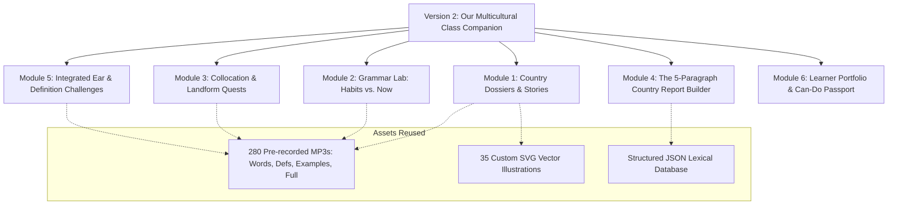

# Pedagogical Review & Blueprint for Version 2 (v2)
**Curricular Source:** *English 6th Grade (ΣΤ΄ Δημοτικού) — Unit 1: "Our Multicultural Class"*  
**Publisher:** Ministry of Education / ITYE "Diophantus" / Pedagogical Institute  
**Authors:** E. Efraimidou, E. Zoi-Reppa, F. Frouzaki  

---

## 1. Pedagogical Review of the Unit & Curricular Alignment

### 1.1 Curricular Context & Thematic Pillars
Unit 1 (*"Our Multicultural Class"*) is designed for 11–12 year-old EFL learners in Greek primary schools transitioning to Level A2+/B1 (CEFR). The unit is built on the following pillars:

| Curricular Notion | Manifestation in Coursebook | Target Communicative Competence |
| :--- | :--- | :--- |
| **Multiculturalism & Empathy** | Newcomers from Ukraine, Albania, Georgia, and the UK introducing their homelands, families, challenges, and cultural pride. | Talking about origins, intercultural respect, celebrating diversity in the classroom. |
| **Cross-Curricular CLIL** | **Geography & History:** Landforms (plains, rivers, peninsulas, mountains), cardinal points (N, S, E, W), borders, ancient roots (Illyria, Colchis, Argonauts), natural disasters, and Chernobyl. | Reading thematic maps, geographic report comprehension, and environmental awareness. |
| **Grammar in Functional Context** | **Present Simple** (habits, general truths, geographical facts) + **Adverbs of Frequency** vs. **Present Continuous** (temporary actions happening in the computer lab right now). | Accurately differentiating permanent routines and ongoing events in speech and writing. |
| **Collocations & Word Partnerships** | Fixed lexical chunks: *share borders, split in two parts, temperature drops below zero, grow citrus fruit/vines, work in a coal mine/lab*. | Moving beyond isolated words to natural phrasing. |
| **Genre Writing (Scaffolded Production)** | Gwen's 5-paragraph country report model (Intro/Borders $\rightarrow$ Landscape $\rightarrow$ Weather $\rightarrow$ People $\rightarrow$ Opinion), leading to a Portfolio Report about Greece. | Structured paragraphing, sentence joining with *"and"*, and peer editing. |

---

### 1.2 Evaluation of Current Application (Version 1)

```
                       CURRENT STATE (v1)                                               TARGET STATE (v2)
┌─────────────────────────────────────────────────────────────┐         ┌─────────────────────────────────────────────────────────────┐
│                      ISOLATED LEXIS                         │         │                    INTEGRATIVE CLIL LAB                     │
│  • 35 dictionary words in alphabetical / search view        │         │  • Story-driven Country Dossiers (Sasha, Christina, Georgi) │
│  • Flashcard flip (Word ↔ Definition/Example)              │  ───►   │  • Grammar Bridge: Present Simple vs. Continuous Lab        │
│  • Multiple choice listening to Greek translation           │         │  • Collocation & Landform Map Quests                        │
│  • Multiple choice listening to English definition          │         │  • Interactive 5-Paragraph Country Report Builder           │
│  • Printable sheet of isolated items                        │         │  • Reusable Audio/Visual Asset Ecosystem                    │
└─────────────────────────────────────────────────────────────┘         └─────────────────────────────────────────────────────────────┘
```

#### What Version 1 Does Exceptionally Well
- **High-Fidelity Dual Voice Synthesis:** Complete pre-recorded MP3 coverage (280 files) across both Neural AI (Sonia) and Google TTS.
- **Micro-Listening Accuracy:** Students can isolate single-word pronunciation, spoken definitions, and contextual sentences.
- **Polished Presentation:** Responsive UI, color-coded phonetic/grammatical tags, and print stylesheets.

#### Pedagogical Gaps Identified Against the Official Coursebook
1. **Decontextualized Lexis:** In v1, words like *peninsula, citrus fruit, coal mine, border, brave, plain* exist in isolation. In the book, pupils learn *citrus fruit* because Georgi's family grows lemons along the warm Black Sea coast, and *border* because Albania borders Greece.
2. **Missing Grammar Synthesis:** Unit 1 explicitly contrasts **habits/facts** (*"It often rains heavily in winter"*) with **present lab actions** (*"Anne is pasting a photo"*). Version 1 has zero grammatical interplay.
3. **Neglect of Collocations:** Exercise B in Lesson 3's *Check Yourself* tests key collocations (*share borders*, *drop below zero*). v1 only tests single-word recognition.
4. **No Scaffolded Production (Genre Writing):** The culmination of Unit 1 is writing a structured country profile for a European partner. v1 remains purely receptive (reading/listening) without guided writing.
5. **Missing Self-Assessment ("Can-Do" Statements):** The official curriculum emphasizes learner autonomy through self-assessment checklists.

---

## 2. Architectural & Instructional Blueprint for Version 2 (v2)

Version 2 will be a dedicated, cohesive learning platform that **reuses 100% of the existing audio and visual assets** while reorganizing the user experience around the unit's actual learning flow.



---

### Module 1: The Newcomers' Dossiers (Contextual CLIL Explorer)
Instead of a flat alphabetical table, organize the 35 vocabulary words into the **authentic country narratives** from Lesson 1:

1. **Sasha’s Ukraine Dossier:**
   - *Key Lexis:* `border`, `capital`, `coast`, `river`, `plain`, `mountain`, `nuclear`, `water supplies`, `accident`, `brave`, `outgoing`.
   - *Interactive Element:* Clickable interactive country map showing the Carpathians, the River Dnipro, Chernobyl, and Odessa on the Black Sea, with audio triggers linking directly to our existing MP3 assets.
2. **Christina’s Albania Dossier:**
   - *Key Lexis:* `ancient`, `shares borders`, `sea`, `disaster`, `earthquake`, `tsunami`, `humanitarian`, `homeland`, `miss`.
   - *Interactive Element:* Natural disasters vs. coastal climate comparison card with audio and imagery.
3. **Georgi’s Georgia Dossier:**
   - *Key Lexis:* `myth`, `mountainous`, `mild`, `vines`, `citrus fruit`, `copper mine`, `coal mine`, `oil well`.
   - *Interactive Element:* Argonauts & Golden Fleece mythological tie-in, highlighting coastal agriculture vs. mountain mining.
4. **Gwen’s United Kingdom Dossier (Lesson 3):**
   - *Key Lexis:* `channel`, `tunnel`, `island`, `multicultural`, `races`, `opinion`.

---

### Module 2: The Grammar Lab ("Habits vs. Right Now")
Directly addresses Lesson 2's core target: **Present Simple with Adverbs of Frequency** vs. **Present Continuous**:

1. **Interactive "Mr. Badluck’s Day" Activity (Lesson 2.4B):**
   - Contrasts routine actions (*"Mr. Badluck usually wakes up at 7:00..."*) with present misadventures (*"...but today his alarm is ringing late, and bus drivers are striking!"*).
   - Students drag and drop target verbs into the correct tense box.
2. **"At the School Lab" Scene Builder (Lesson 2.1 - 2.2):**
   - Animated or interactive school lab scene: Maria searching for instruments, Markos printing photos of the Taj Mahal, Sophia printing science texts, Anne pasting molecular formulas.
   - Auditory discrimination: Hear a sentence and classify whether it is an **Everyday Habit (Present Simple)** or an **Action Happening Right Now (Present Continuous)**.
3. **Adverbs of Frequency Gauge:**
   - Visual slider from 0% to 100% (*Never $\rightarrow$ Rarely $\rightarrow$ Sometimes $\rightarrow$ Often $\rightarrow$ Usually $\rightarrow$ Always*). Students arrange vocabulary sentences according to frequency.

---

### Module 3: Collocation & Landform Quest (Lesson 3 "Check Yourself")
Replaces isolated multiple-choice with authentic lexical partnerships:

1. **Collocation Matching Pairs:**
   - `share` $\leftrightarrow$ `borders`
   - `temperature drops` $\leftrightarrow$ `below zero`
   - `grow` $\leftrightarrow$ `citrus fruit / tea / vines`
   - `work in a` $\leftrightarrow$ `coal mine / copper mine / school lab`
   - `split in` $\leftrightarrow$ `two parts (River Dnipro)`
   - `swim in the` $\leftrightarrow$ `clear sea / river`
2. **Interactive Geography Crossword (Lesson 3.A):**
   - Digital reproduction of the book's crossword puzzle (Across: *Carpathians, borders, forest, peninsula, coast, West*; Down: *landforms, East, capital, plains, North*).
   - Audio hints trigger our pronunciation and definition MP3s upon tapping any crossword clue!

---

### Module 4: The 5-Paragraph Country Report Builder (Writing Workshop)
Transforms vocabulary into productive written competence (Lesson 3.1C):

1. **Scaffolded Report Structure:**
   - **Paragraph 1: Identity & Location** (Country name, capital, borders, seas).
   - **Paragraph 2: Landscape & Terrain** (Mountains, plains, rivers, islands).
   - **Paragraph 3: Weather & Climate** (Rainfall, temperature extremes, seasonal changes).
   - **Paragraph 4: People, Culture & Work** (Traditions, industries, daily activities, multicultural makeup).
   - **Paragraph 5: Personal Opinion** (Why it is interesting/exciting to visit or live there).
2. **"My Country: Greece" Interactive Report Creator:**
   - Guided sentence generator with vocabulary drop-downs and conjunction linking (*"and"*, *"but"*, *"so"*).
   - Instant export to a formatted, printable PDF page for the student's actual physical English portfolio.

---

### Module 5: Upgraded Challenge Suite (Formative Assessment)
Builds upon the work completed in v1:

1. **Challenge 1: Greek Translation Listening** (Audio word $\rightarrow$ Greek meaning).
2. **Challenge 2: English Definition Listening** (Audio word $\rightarrow$ English definition).
3. **Challenge 3 (NEW): Contextual Sentence Gap-Fill** (Audio sentence with target word beeped/missing $\rightarrow$ select the correct lexical item in context).
4. **Challenge 4 (NEW): True / False Geography Fact Buster** (Directly from Lesson 1's opening quiz: *Ukraine borders the Aegean Sea? False! The Carpathians are high mountains? True!*).

---

### Module 6: Learner Autonomy & "Can-Do" Passport
Empowers the learner in accordance with the book's *10-λογος για την αυτονόμηση του μαθητή*:

- Visual progress checklist:
  - $\square$ *I can read maps and describe country borders and landforms.*
  - $\square$ *I can talk about school subjects and lab activities.*
  - $\rightarrow$ *I can contrast everyday routines with actions happening right now.*
  - $\square$ *I can write a 5-paragraph country report using connectors.*
- Generates a personalized certificate upon completing all unit milestones.

---

## 3. Technical & Implementation Strategy

### Asset Sharing Guarantee
Version 2 will run side-by-side or as an upgraded mode without altering existing data:
- **Audio Files:** Uses all 280 pre-recorded MP3 files (`assets/audio` and `assets/audio_neural`).
- **Images:** Uses all 35 custom SVG vector icons (`assets/images`).
- **Data Model:** Extends `data/vocabulary_data.json` with contextual tags (`lesson`, `country`, `collocations`, `grammar_focus`).
- **File Structure:** Can be developed cleanly in `index_v2.html`, `app_v2.js`, and `style_v2.css`, leaving the current stable version untouched while allowing seamless switching between v1 and v2.
